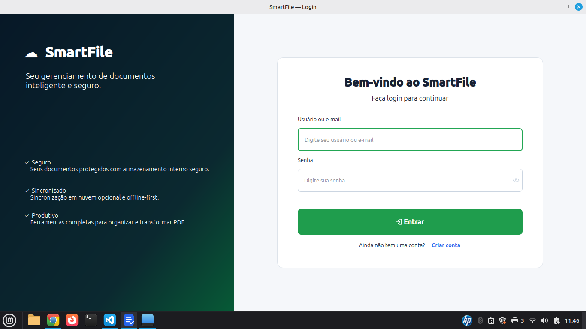
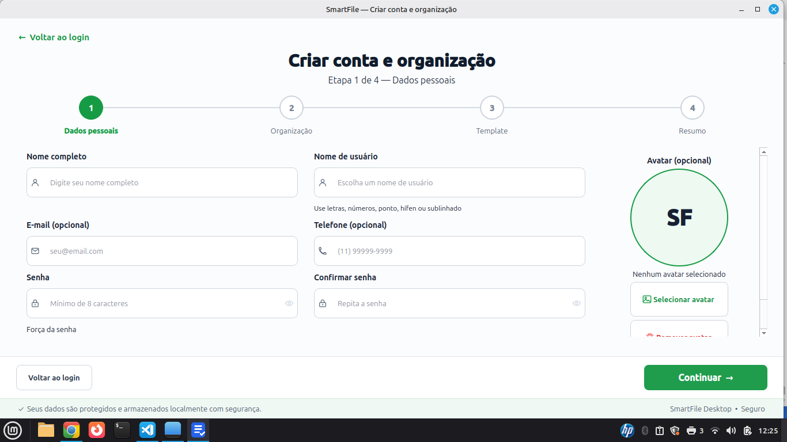

# SmartFile

O SmartFile é uma aplicação desktop multiplataforma para gestão local de
documentos. O projeto reúne Mini GED, organizações, pastas lógicas, scanner,
conversão de arquivos, visualização e manipulação de PDFs, assinaturas e
sincronização opcional com provedores de nuvem.

> **Versão beta para avaliação. Não utilize o SmartFile como única cópia de
> documentos importantes.**

O armazenamento interno continua sendo a fonte principal dos documentos. A
nuvem é uma camada opcional de sincronização e não substitui backups
independentes.

## Funcionalidades principais

- cadastro local, login e perfis administrativos;
- organizações independentes e pastas lógicas;
- perfis de recursos Pessoal, Estudante, Empresarial e Essencial, separados dos
  templates de pastas;
- explorador simplificado de importação, busca combinada com filtros indexados,
  ações contextuais, favoritos, recentes, histórico e lixeira;
- armazenamento interno gerenciado com SQLite e checksums SHA-256;
- recuperação offline de senha com códigos de uso único protegidos por Argon2id;
- visualizador interno de PDF com navegação, zoom, miniaturas e pesquisa;
- **Captura e PDF**, experiência integrada para digitalizar, importar imagens,
  abrir ou mesclar PDFs, reorganizar, girar, extrair, salvar e adicionar ao GED;
- assinatura digital e assinatura manuscrita;
- scanner SANE no Linux e TWAIN no Windows, integrado ao workspace de PDF sem
  exigir arquivo intermediário;
- conversor responsivo com formatos compatíveis, progresso, cancelamento,
  histórico da sessão e abertura do resultado;
- backup completo em ZIP para administradores;
- sincronização opcional com Microsoft OneDrive ou Google Drive;
- para organizações empresariais: controle de acesso, solicitações com prazo,
  auditoria e transporte NAS resiliente;
- **Solicitações e Entregas** com cesta referencial, protocolo auditável,
  transferência HTTP 1:1 entre instalações SmartFile, SHA-256, fila offline,
  visto e confirmação de recebimento. Essa entrega LAN é independente do NAS.

## Perfis de recursos

O template cria somente as pastas iniciais. O perfil define o limite de
capacidades; cada organização ativa somente os recursos que realmente utiliza:

- **Pessoal:** ações contextuais, busca inteligente, filtros, histórico e nuvem;
- **Estudante:** recursos normais, filtros indexados e assinatura digital;
- **Empresarial:** permite controle de acesso, solicitações, prazos, auditoria,
  nuvem e transporte corporativo, todos configuráveis individualmente;
- **Essencial:** documentos e busca sem ativação automática de nuvem.

No perfil Empresarial, controle de acesso e auditoria são sugeridos como padrão.
Nuvem, transporte corporativo, solicitações e prazos começam desativados. O modo
NAS possui transferência real para um caminho que já esteja acessível pelo
sistema operacional. O SmartFile não monta compartilhamentos. Credenciais
opcionais são mantidas exclusivamente no cofre do sistema operacional por meio
do `keyring`; o SQLite guarda apenas uma referência opaca. HTTPS e LAN continuam
configuráveis, mas não executam transferência.

Cloud Layer e transporte corporativo são camadas independentes. OneDrive e
Google Drive usam OAuth e fila de sincronização. NAS, LAN e HTTPS são destinos
administrativos da organização e não exigem conta de nuvem nem alteram seu modo
de sincronização.

### Solicitações e Entregas na rede local

O workspace **Solicitações e Entregas** diferencia o pedido documental da
transferência efetiva. A solicitação percorre `OPEN → IN_PROGRESS → ATTENDED →
DELIVERING → DELIVERED → COMPLETED`; atraso é calculado pelo prazo e não apaga o
estado principal. Os documentos oficiais permanecem no GED e a cesta guarda
somente suas referências.

Cada instalação possui UUID permanente. O endereço IP apenas localiza o peer
cadastrado. Uma entrega gera protocolo legível, envia os arquivos em chunks,
valida tamanho e SHA-256 no destinatário e somente então assume `DELIVERED`. Se o
peer estiver offline, o protocolo permanece `QUEUED` para retry com backoff.

O HTTP local desta beta é destinado a laboratório em rede confiável. HTTPS e
autenticação criptográfica entre instalações estão preparados como evolução,
mas ainda não estão declarados como implementados. Consulte o
[roteiro Mint ↔ Zorin](docs/DELIVERY_LAN_TEST.md) e o
[contrato HTTP](docs/DELIVERY_HTTP_API.md).

### Transporte NAS

Quando uma organização Empresarial habilita `server_transport` e configura um
NAS ativo, a importação continua sendo concluída primeiro no storage local. Um
job separado é então processado em background:

```text
Storage local → Transport Queue → NAS → SHA-256 → COMPLETED
```

Em caso de indisponibilidade, o job permanece em `RETRY` e o documento local
continua utilizável. O destino deve estar montado no Linux ou acessível como UNC
no Windows. A ação **Testar conexão** verifica diretório, acesso e escrita sem
sobrescrever arquivos existentes.

Cada job referencia um snapshot imutável do destino físico. Ao trocar NAS A por
NAS B, operações antigas continuam associadas ao NAS A e novos documentos passam
a usar o NAS B. Jobs legados cujo destino não possa ser comprovado entram em
`NEEDS_RECONCILIATION` e não acessam nenhum caminho até uma decisão administrativa.
Ao escolher Local, a fila histórica é preservada e pausada, sem exclusão remota
em massa.

Na configuração empresarial, OWNER/ADMIN pode cadastrar, substituir ou remover
uma credencial de transporte. A senha nunca é preenchida de volta na interface,
não aparece em logs/auditoria e não é armazenada no banco. No Linux o backend do
`keyring` usa o Secret Service disponível; no Windows usa o Credential Manager.
Se o cofre não estiver disponível, a operação falha de forma segura e a
configuração anterior permanece válida.

## Capturas de tela

### Login



### Cadastro de conta e organização



O procedimento ilustrado completo — dados pessoais, organização, template,
revisão e códigos de recuperação — está disponível no
[Manual do Usuário](docs/Manual_Usuario.md#3-primeiro-acesso).

## Camada de Nuvem

A Cloud Layer mantém os módulos do SmartFile desacoplados das APIs externas:

```text
Documentos / Scanner
        │
        ▼
Storage interno + SQLite
        │
        ▼
Cloud Queue
        │
        ▼
Cloud Layer
   ┌────┴─────┐
   ▼          ▼
OneDrive  Google Drive
```

Nenhum módulo documental acessa diretamente o Microsoft Graph ou o Google
Drive. Uploads, downloads, renomeações, movimentações, exclusões e consultas de
alterações passam pelo contrato comum da Cloud Layer.

### Funcionamento por organização

- cada organização escolhe entre `Local`, `OneDrive` ou `Google Drive`;
- somente uma conta de nuvem fica ativa por organização;
- documentos, pastas, fila, cursor remoto e pasta raiz são isolados por
  organização;
- trocar a organização ativa não troca nem expõe a conta de outra organização;
- o SmartFile mantém na nuvem uma pasta `SmartFile` e uma raiz própria para cada
  organização sincronizada.

### Funcionamento offline

O documento é salvo primeiro no storage interno e no SQLite. Se não houver
internet, a operação permanece na fila e o arquivo continua disponível
localmente. Quando a conexão retorna, o worker tenta processar a pendência sem
bloquear a interface.

Estados documentais utilizados:

- `LOCAL_ONLY`;
- `PENDING_UPLOAD`;
- `UPLOADING`;
- `SYNCED`;
- `PENDING_DOWNLOAD`;
- `CONFLICT`;
- `SYNC_ERROR`;
- `REMOTE_DELETED`;
- `LOCAL_DELETED`.

### Autenticação e segurança

- autenticação OAuth pelo navegador do sistema;
- Microsoft por MSAL e Microsoft Graph;
- Google por `google-auth-oauthlib` e Google Drive API;
- tokens preferencialmente armazenados no keyring do sistema;
- fallback local cifrado quando o keyring não estiver disponível;
- tokens e refresh tokens não são gravados no SQLite nem exibidos na interface;
- senhas, tokens e credenciais não devem aparecer em logs;
- remover uma conta apaga o vínculo e os tokens locais que não estejam sendo
  usados por outra organização;
- nenhuma credencial OAuth pessoal é incluída nos instaladores.

### Configuração OAuth administrativa

A opção **Configurar provedor** é exclusiva do administrador global do
SmartFile. Ela configura o aplicativo OAuth; cada usuário conecta depois sua
própria conta pelo botão **Adicionar Conta**.

Para o OneDrive:

1. registrar um aplicativo Desktop no Microsoft Entra;
2. configurar o redirect URI `http://localhost`;
3. habilitar fluxo de cliente público;
4. conceder permissões delegadas `User.Read` e `Files.ReadWrite`;
5. informar o Client ID e o tenant ao SmartFile.

Para o Google Drive:

1. criar um projeto no Google Cloud;
2. habilitar a Google Drive API;
3. configurar a tela de consentimento;
4. criar um cliente OAuth do tipo **Aplicativo para computador**;
5. fornecer o JSON do cliente na configuração administrativa.

Consulte [OAuth de nuvem — configuração administrativa](docs/OAUTH_DESENVOLVIMENTO.md)
e o [relatório formal da Cloud Layer](docs/RELATORIO_FORMAL_IMPLEMENTACAO_CLOUD_LAYER.md).

### Limitações da nuvem

- sincronização não equivale a backup;
- não há colaboração em tempo real;
- não há compartilhamento ou permissões remotas;
- conflitos não são resolvidos automaticamente;
- contas, consentimento, políticas corporativas, proxy e MFA dependem da
  configuração externa de cada ambiente;
- a homologação completa deve ser feita com contas de teste, nunca com
  documentos ou certificados pessoais.

## Tecnologias

- Python 3.12;
- PyQt6;
- SQLite nativo;
- PyMuPDF, pypdf, pyHanko, reportlab e Pillow;
- python-docx, openpyxl, pandas e LibreOffice quando disponível;
- MSAL e Google OAuth;
- keyring;
- SANE no Linux e TWAIN no Windows;
- PyInstaller e Inno Setup para distribuição.

## Executar pelo código-fonte

Crie um ambiente virtual, instale as dependências e execute:

```bash
python -m pip install -r requirements.txt
python run.py
```

No Linux, o scanner pode exigir `libsane` e ferramentas SANE do sistema. No
Windows, instale o driver TWAIN x64 fornecido pelo fabricante do scanner.

## Pacote Linux beta

O pacote Linux amd64 é destinado a testes em sistemas compatíveis baseados em
Linux Mint, Ubuntu e Debian:

```bash
sudo apt install ./smartfile_0.9.0~beta2_amd64.deb
```

A remoção normal preserva banco, documentos, configurações e backups do
usuário. Consulte [SmartFile Beta Linux](docs/BETA_LINUX.md).

## Pacote Windows experimental

O GitHub Actions gera:

- `SmartFile-0.9.0-beta.2-Windows-x64-Setup.exe`;
- `SmartFile-0.9.0-beta.2-Windows-x64-Portable.zip`;
- checksums SHA-256 dos dois arquivos.

O instalador é construído em um runner oficial Windows com PyInstaller onedir e
Inno Setup. Nenhuma release final é publicada automaticamente.

Abra [Windows beta package](https://github.com/boente66/SmartFile/actions/workflows/build-windows.yml)
para executar ou baixar um build temporário. Antes da distribuição, siga o
[Guia de teste Windows Beta](docs/GUIA_TESTE_WINDOWS_BETA.md).

## Estrutura do projeto

```text
SmartFile/
├── app/
│   ├── cloud/
│   ├── controllers/
│   ├── database/
│   ├── entities/
│   ├── repositories/
│   ├── services/
│   ├── views/
│   └── workers/
├── assets/
├── docs/
├── packaging/
├── scripts/
├── tests/
├── requirements.txt
├── requirements-windows.txt
└── run.py
```

## Testes

```bash
python -m compileall -q app tests run.py
python -m pytest -q
python -m pip check
git diff --check
```

Builds do instalador não substituem testes manuais em Windows ou Linux reais,
especialmente para scanner, assinatura digital, conversores externos e OAuth.

## Roadmap

- estabilização e homologação dos pacotes beta;
- assinatura de código dos instaladores;
- validação ampliada com contas de nuvem de teste;
- tratamento assistido de conflitos;
- sincronização incremental e versionamento remoto;
- preparação de uma versão candidata à 1.0.

## Contribuição

1. Faça um fork do repositório.
2. Crie uma branch para a alteração.
3. Implemente e execute os testes.
4. Abra um pull request descrevendo impacto e validações.

Consulte [CONTRIBUTING.md](CONTRIBUTING.md) e
[CODE_OF_CONDUCT.md](CODE_OF_CONDUCT.md).

## Licença

O SmartFile é distribuído sob a licença MIT. Consulte [LICENSE](LICENSE).
